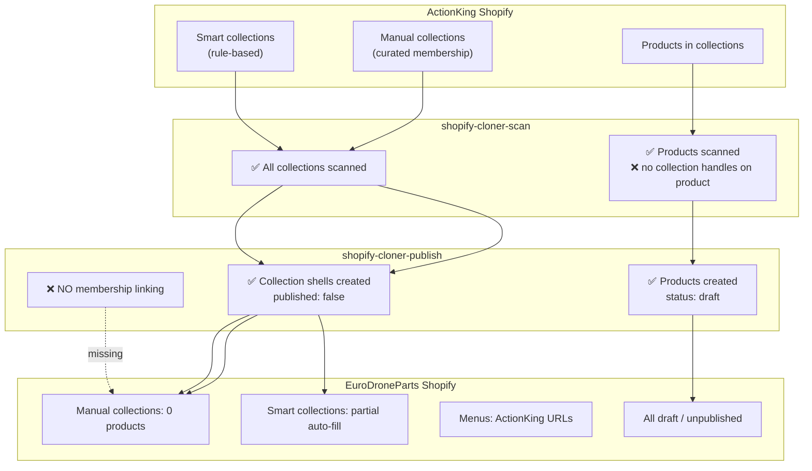

# Collection Linking — Analysis & Fix Plan

**Date:** 2026-06-07  
**Scope:** Shopify collection copy + product membership during store clone  
**Primary use case:** ActionKing → EuroDroneParts (`shopify-cloner-*` full path)  
**Evidence:** Static analysis of `shopify-cloner-scan`, `shopify-cloner-publish`, `shopify-drone-clone`, `seo-wizard-sync`, `sync-shopify-pages`

---

## Executive Summary

| Question | Answer |
|----------|--------|
| Are collection **definitions** copied? | **Yes** (title, handle, body, image, SEO, rules, metafields) — both clone paths |
| Are collection **memberships** copied? | **Full cloner: No.** Drone clone: **Partial** (custom only, silent failures) |
| Smart collections supported? | **Rules copied**; membership is **rule-driven** (not `collects.json`) |
| Manual collections supported? | **Shell copied**; **product links missing** in full cloner |
| ActionKing → EuroDroneParts impact | **High** — navigation, IA, and collection SEO pages break without post-clone manual work |
| Recommended fix | **P0** — add membership linking to `shopify-cloner-publish` + scan product→collection handles |

**Effort:** 3–5 engineering days · **Risk:** Medium (rate limits, rule mapping edge cases) · **Priority:** Fix before relying on full cloner for EuroDroneParts go-live without manual Shopify Admin work

---

## 1. Which Collections Are Copied Correctly?

### Full cloner (`shopify-cloner-scan` → `shopify-cloner-publish`)

All collections in scan scope (`collection` in `DEFAULT_TYPES`) have **metadata** published to the target store.

| Field | Scanned | Published | Status |
|-------|---------|-----------|--------|
| Title | ✅ `title` | ✅ | Copied |
| Handle | ✅ `handle` | ✅ | Copied |
| Body / description | ✅ `descriptionHtml` | ✅ `body_html` | Copied |
| Collection image + alt | ✅ `image` | ✅ | Re-hosted via image proxy |
| SEO title / description | ✅ `seo` | ✅ | As `global.title_tag` / `description_tag` metafields |
| Collection metafields | ✅ first 50 | ✅ | Copied |
| Template suffix | ✅ `templateSuffix` | ✅ | Copied |
| Collection-level sort order | ✅ `sortOrder` | ✅ | e.g. `best-selling`, `manual` |
| **Smart collection rules** | ✅ `ruleSet.rules` | ✅ | `column`, `relation`, `condition`, `disjunctive` |
| **Custom collection product membership** | ❌ not scanned on products | ❌ no `collects.json` | **Not copied** |
| Published to Online Store | ✅ source state | ⚠️ forced `published: false` | Target collections start **unpublished** |

**Source:** `COLLECTION_QUERY` in `shopify-cloner-scan/index.ts` (lines 161–173); `buildCollectionPayload()` in `shopify-cloner-publish/index.ts` (lines 324–362).

### Drone clone (`shopify-drone-clone`)

Only **drone-filtered** collections (title/handle/description match `looksDroney()`).

| Field | Status |
|-------|--------|
| Collection metadata (subset) | ✅ Same REST payload pattern |
| Smart rules | ✅ |
| Product membership (custom) | ✅ via `collects.json` after product create |
| Non-drone collections | ❌ **Not scanned, not copied** |

**Source:** `shopify-drone-clone/index.ts` lines 152–171 (filter), 342–354 (linking).

### What works after clone (collection definitions)

```
✅ Collection records exist on target (custom + smart)
✅ Collection handles match source (same URL paths when published)
✅ Smart collection rules recreated (may auto-include matching products)
✅ Collection SEO metafields on target
✅ cloner_object_mappings updated with target collection IDs
```

---

## 2. Which Collections Are NOT Copied?

### A. Not copied at all

| Item | Full cloner | Drone clone | Notes |
|------|-------------|-------------|-------|
| Collections outside drone keyword filter | ✅ all scanned | ❌ skipped | Drone path is subset only |
| Search & Discovery settings | ❌ | ❌ | Complementary products, filters — no API in cloner |
| Sales channel publication state | ❌ | ❌ | Collections created `published: false` |
| Manual **product order** inside a collection | ❌ | ❌ | `collects.json` adds membership only; no `collectionReorderProducts` |
| Collection membership for **unmigrated** products | N/A | N/A | If product filtered out, link impossible |

### B. Copied as empty shells (critical gap)

| Item | Full cloner | Drone clone |
|------|-------------|-------------|
| **Manual (custom) collection membership** | ❌ products not linked | ⚠️ linked for drone products only; `.catch(() => null)` hides errors |
| Products in collection but collection not in drone set | N/A | ❌ link skipped (`colId` missing) |
| Menu items pointing to collections | ⚠️ menu created | ⚠️ **source URLs kept** — not remapped to target handles/domains |

### C. Partial / rule-dependent

| Item | Risk |
|------|------|
| Smart collection auto-membership | Works only if cloned product **attributes match rules** (tag, type, vendor, price). Draft products + unpublished collections reduce storefront visibility. |
| Smart rule column mapping | GraphQL enum → REST via `.toLowerCase()` — may break on edge columns (see §4). |
| `collection_reference` metafields | ⚠️ remapped in post-pass if `remap_metafields: true`; broken until then |

---

## 3. Are Smart Collections Supported?

### Definition: **Yes**

Both paths detect smart collections when `ruleSet.rules.length > 0` and POST to `smart_collections.json` with:

- `rules[]` — `column`, `relation`, `condition`
- `disjunctive` — OR vs AND logic
- `sort_order` — collection-level default sort

```324:349:supabase/functions/shopify-cloner-publish/index.ts
function isSmartCollection(src: any): boolean {
  return Array.isArray(src?.ruleSet?.rules) && src.ruleSet.rules.length > 0;
}
// ...
        rules: (src.ruleSet.rules || []).map((r: any) => ({
          column: String(r.column || '').toLowerCase(),
          relation: String(r.relation || '').toLowerCase(),
          condition: r.condition,
        })),
        disjunctive: !!src.ruleSet.appliedDisjunctively,
```

### Membership: **Indirect only (by design)**

Smart collections **must not** use `collects.json` — Shopify populates them from rules when products match.

| Scenario | Expected behavior after clone |
|----------|------------------------------|
| Rule: `tag equals drone` | ✅ Works if product tags copied identically |
| Rule: `type equals Accessories` | ✅ Works if `product_type` copied |
| Rule: `vendor equals ActionKing` | ⚠️ May fail if transform renames vendor |
| Rule referencing inventory/price thresholds | ⚠️ Works only if price/qty copied correctly |
| Rule using GraphQL-only columns | ❌ Possible mapping failure after `.toLowerCase()` |
| Products left in **draft** (full cloner) | ⚠️ Admin shows matches; Online Store may not surface until publish |

### Known smart-collection gaps

1. **No validation** that rules evaluate correctly on target (no post-publish count check).
2. **Rule column mapping** not explicitly tested (`TYPE` → `type`, `PRODUCT_TYPE` → `product_type` — REST expects `type` not `product_type`).
3. **Transform step** can change tags/titles/vendor → breaks smart rules silently.
4. **Drone clone** still POSTs `collects.json` for smart collections — fails silently (harmless but noisy).

---

## 4. Are Manual Collections Supported?

### Definition: **Yes**

Custom collections (no `ruleSet` or empty rules) POST to `custom_collections.json` with title, body, handle, image, metafields.

### Membership: **No (full cloner) / Partial (drone)**

| Path | Membership mechanism | Status |
|------|---------------------|--------|
| Full cloner | None | ❌ **No `collects.json` or `collectionAddProducts`** anywhere in publish loop |
| Drone clone | `POST collects.json` per product×collection | ⚠️ Works for custom; errors swallowed |
| `sync-collections-to-shopify` | `collectionAddProducts` GraphQL | ✅ Exists but **separate** — uses `product_type_collections` (internal app), not cloner |
| `shopify-collection-write` | `addProducts` action | ✅ Generic API — **not wired to cloner** |
| `publish-sunsky-to-shopify` | `collectionAddProducts` | ✅ Supplier publish only |

**Full cloner product scan does not include collection membership:**

```123:148:supabase/functions/shopify-cloner-scan/index.ts
const PRODUCT_QUERY = `
query Products($cursor: String) {
  products(first: 50, after: $cursor) {
    nodes {
      id handle title descriptionHtml vendor productType tags status templateSuffix
      // ❌ NO collections { nodes { handle } }
```

**Drone clone does scan membership (max 25 collections per product):**

```63:63:supabase/functions/shopify-drone-clone/index.ts
      collections(first: 25) { nodes { id handle title } }
```

### Manual sort order within collection

ActionKing likely uses **manual** collection sort (`sort_order: manual`) with a curated product order. Cloner copies collection-level `sort_order` but **not** per-product positions → even after membership fix, **order may differ** unless `collectionReorderProducts` is added (P2).

---

## 5. ActionKing → EuroDroneParts Clone — What Happens?

### Typical workflow (recommended in `CLONE_VERIFICATION_REPORT.md`)

```
1. shopify-cloner-import-connected  (ActionKing + EuroDroneParts tokens)
2. shopify-cloner-scan              (scope: product, collection, page, menu, …)
3. Transform DISABLED               (faithful copy)
4. shopify-cloner-publish           (batched, 25 items/batch, arbitrary order)
5. remap_metafields: true           (fix GID references)
6. Manual: activate products, publish collections, fix menus
```

### Step-by-step collection outcome



### Per collection type on target

| Collection type | After full clone | Manual work required |
|-----------------|------------------|----------------------|
| **Manual / custom** | Empty collection pages | Assign products in Shopify Admin OR run collects script |
| **Smart (tag/type/vendor rules)** | May partially fill | Verify counts; fix rules if transform changed tags |
| **Smart (complex rules)** | Unpredictable | Audit each high-traffic collection |
| **Navigation menus** | Broken links to `actionking.se` | Rewrite menu URLs to EuroDroneParts domain |
| **SEO registry (`pages`)** | Empty until `sync-shopify-pages` | Run page sync on EuroDroneParts after publish + activate |
| **Search & Discovery** | Not copied | Reconfigure in Shopify Admin |

### Drone clone alternative

If team uses `shopify-drone-clone` instead:

- Only drone-titled collections + related products migrate.
- **Custom** membership linked for that subset.
- **Not suitable** for full ActionKing → EuroDroneParts catalog clone.

---

## 6. SEO Impact

### Direct SEO damage

| Issue | SEO effect | Severity |
|-------|------------|----------|
| **Empty manual collections** | Collection URLs return 200 but thin/empty content; poor crawl value; broken category landing pages | **High** |
| **Collection `published: false`** | Collection pages not on Online Store → not indexable | **High** |
| **Products in `draft`** | Product URLs not live; no organic traffic | **High** |
| **Broken menu / internal links** | Crawl depth increases; link equity lost; poor UX signals | **High** |
| **Smart collections wrong count** | Misleading category pages; keyword targeting off | **Medium** |
| **Redirects not rewritten** | 404s or wrong-domain targets from old ActionKing paths | **High** |
| **Breadcrumbs / theme collection context** | Products appear orphaned; weaker topical clustering | **Medium** |

### DigitalSignal SEO module impact (post-clone)

| Module | Behavior | Impact |
|--------|----------|--------|
| `seo-wizard-sync` | Reads **live Shopify** collections + `fetchAllCollects()` for product↔collection mapping in `seo_targets` | After clone: sync sees **empty custom collections** until membership fixed |
| `sync-shopify-pages` | Upserts `pages` with `page_type: 'collection'`; status from `published_at` | Collections imported as **draft** pages locally |
| `seo-wizard-publish` | Pushes `descriptionHtml` to Shopify | Collection body SEO can be fixed **after** shells exist |
| `ia-analysis` | Uses `product_type_collections` / `shopify_products` — **not Shopify collection graph** | IA scores **decoupled** from Shopify membership gap |
| `ai-visibility-analyze` | Reads `pages` | Collection pages exist but may show draft / thin content |

### SEO recovery sequence (current manual process)

```
1. Fix collection membership (manual Admin or script)     ← blocked today on full cloner
2. Bulk publish products + collections to Online Store
3. Run sync-shopify-pages on EuroDroneParts
4. Run seo-wizard-sync (update_collections action)
5. SEO pass on top collection pages
6. Fix menus + redirects for EuroDroneParts domain
```

**Without membership fix, steps 3–5 operate on structurally broken collection pages.**

---

## 7. Exact Code Changes Needed

### Phase 1 — P0: Membership linking in full cloner (required)

#### 7.1 Scan: capture product → collection handles

**File:** `supabase/functions/shopify-cloner-scan/index.ts`

Add to `PRODUCT_QUERY` inside `nodes {`:

```graphql
collections(first: 50) {
  pageInfo { hasNextPage endCursor }
  nodes { id handle title }
}
```

Optional: paginate if `collections.pageInfo.hasNextPage` (products in >50 collections — rare).

#### 7.2 Shared helper: link product to collections

**New file:** `supabase/functions/_shared/cloner-collection-link.ts`

Extract and harden logic from `shopify-drone-clone/index.ts` lines 342–354:

```typescript
export type CollectionLinkResult = {
  attempted: number;
  linked: number;
  skipped_smart: number;
  skipped_unmapped: number;
  errors: string[];
};

export async function linkProductToCollections(opts: {
  migrationId: string;
  admin: SupabaseClient;
  targetDomain: string;
  targetToken: string;
  apiVersion: string;
  targetProductId: number;
  sourceCollections: Array<{ handle: string; id?: string }>;
  collectionKindByHandle: Map<string, 'smart' | 'custom'>; // from migration items
  rest: RestFn;
}): Promise<CollectionLinkResult>;
```

Behavior:

1. Resolve target `collection_id` via `cloner_object_mappings` (`object_type = 'collection'`, `source_handle`).
2. Skip if collection is **smart** (rules handle membership).
3. For **custom**: `POST collects.json` `{ collect: { product_id, collection_id } }`.
4. Log failures to `cloner_logs` — **do not swallow errors**.
5. Idempotent: catch "already exists" Shopify errors as success.

#### 7.3 Publish: call linker after each product

**File:** `supabase/functions/shopify-cloner-publish/index.ts`

After product create/update block (~line 1290), add:

```typescript
import { linkProductToCollections } from '../_shared/cloner-collection-link.ts';

// After applyPostCreateVariantHooks(...):
const srcCols = (item.source_payload?.collections?.nodes ?? []) as Array<{ handle: string; id: string }>;
if (srcCols.length > 0 && targetId) {
  const linkResult = await linkProductToCollections({
    migrationId: migration.id,
    admin,
    targetDomain: target.shop_domain,
    targetToken: target.access_token,
    apiVersion: target.api_version,
    targetProductId: Number(targetId),
    sourceCollections: srcCols,
    collectionKindByHandle: await loadCollectionKinds(admin, migration.id),
    rest,
  });
  await admin.from('cloner_logs').insert({
    migration_id: migration.id,
    tenant_id: migration.tenant_id,
    event: 'collection_link',
    object_type: 'product',
    object_id: item.source_id,
    message: `linked=${linkResult.linked} skipped_smart=${linkResult.skipped_smart} unmapped=${linkResult.skipped_unmapped}`,
  });
}
```

`loadCollectionKinds()` — single query on `cloner_migration_items` where `object_type = 'collection'`, derive smart vs custom from `source_payload.ruleSet`.

#### 7.4 Publish ordering (recommended)

**File:** `supabase/functions/shopify-cloner-publish/index.ts` (~line 1243)

Prioritize collections before products within each batch:

```typescript
let q = admin.from('cloner_migration_items')
  .select('*')
  .eq('migration_id', body.migration_id)
  .eq('approval_status', 'approved')
  .neq('publish_status', 'published')
  .order('object_type', { ascending: true }); // collection < product alphabetically
```

Membership linking uses `cloner_object_mappings`, so strict ordering is not mandatory — but reduces unmapped skips within a batch.

#### 7.5 Post-publish batch link pass (belt-and-suspenders)

**File:** `supabase/functions/shopify-cloner-publish/index.ts`

Add optional body flag `link_collections: true` (mirror `remap_metafields`):

- Query all published products for migration.
- Re-run `linkProductToCollections` for any product with `source_payload.collections`.
- Return `{ linked, skipped, failed }` summary.

Enables re-run without re-publishing products.

---

### Phase 2 — P1: Hardening

| Change | File | Purpose |
|--------|------|---------|
| Smart rule column map | `_shared/cloner-collection-link.ts` or `buildCollectionPayload` | Explicit GraphQL→REST map (`TYPE`→`type`, `TAG`→`tag`, …) |
| Batch GraphQL linking | `_shared/cloner-collection-link.ts` | Use `collectionAddProducts` (10 products/call) for rate-limit safety — pattern from `shopify-collection-write` |
| Publish collections to Online Store | `buildCollectionPayload` | Add `publish: true` flag or post-step via Publications API |
| Menu URL remap | `publishMenu()` | Map `COLLECTION`/`PRODUCT` items via `cloner_object_mappings`; rewrite domain |
| Validation report | new `link_collections` response / UI | Compare source vs target product count per collection handle |

---

### Phase 3 — P2: Fidelity extras

| Change | Purpose |
|--------|---------|
| `collectionReorderProducts` after linking | Preserve manual sort order |
| Scan `collects.json` on source | Rebuild membership for products already published in earlier batches |
| Drone clone: remove `.catch(() => null)` | Surface link failures |
| Integration test | ActionKing sample: 5 manual + 3 smart collections |

---

### Files touched (minimum P0)

| File | Action |
|------|--------|
| `supabase/functions/shopify-cloner-scan/index.ts` | Extend `PRODUCT_QUERY` |
| `supabase/functions/_shared/cloner-collection-link.ts` | **Create** |
| `supabase/functions/shopify-cloner-publish/index.ts` | Import linker, call after product publish, optional batch pass |
| `supabase/functions/shopify-drone-clone/index.ts` | Refactor to use shared helper (DRY) |
| `CLONE_VERIFICATION_REPORT.md` | Update checklist when implemented |

**No frontend change required** for P0; optional: expose `link_collections` button in `ShopifyCloner.tsx` next to `remap_metafields`.

---

## 8. Effort Estimate

| Phase | Work | Days | Dependencies |
|-------|------|------|--------------|
| **P0** Scan + shared linker + publish hook | 2–3 | None |
| **P0** Post-publish `link_collections` pass + logging | 0.5–1 | P0 linker |
| **P0** Manual test on ActionKing → EuroDroneParts sandbox | 1 | Shopify dev stores |
| **P1** Rule column map + batch GraphQL + menu remap | 2–3 | P0 |
| **P2** Manual sort order + validation UI | 2–3 | P1 |

| Total | Scope | Calendar |
|-------|-------|----------|
| **Minimum viable fix** | P0 only | **3–5 days** |
| **Production-grade** | P0 + P1 | **5–8 days** |
| **Full fidelity** | P0 + P1 + P2 | **8–11 days** |

---

## 9. Risk Assessment

| Risk | Likelihood | Impact | Mitigation |
|------|------------|--------|------------|
| Shopify REST rate limit on `collects.json` (large catalogs) | **High** | Publish timeouts | Batch with delays; prefer GraphQL `collectionAddProducts`; resume via `link_collections` pass |
| `collects.json` duplicate errors | Medium | Noise / false failures | Treat "already in collection" as success |
| Smart rule column mismatch | Medium | Empty smart collections | Explicit enum map + post-publish count validation |
| Products in >50 collections | Low | Missing links | Paginate `collections` in scan |
| Collection not in migration scope | Medium | Unmapped skips | Log `skipped_unmapped`; document in UI |
| Transform changes tags/vendor | Medium | Smart rules break | Document: disable transform for faithful clone |
| Linking before collection published | Low | Unmapped in same batch | Use `cloner_object_mappings`; optional order + batch pass |
| Silent failures (drone pattern) | High today | Unknown data loss | Structured logging; no `.catch(() => null)` |

**Overall risk: Medium** — well-understood Shopify APIs; main risk is scale (ActionKing catalog size) and operational verification, not architectural uncertainty.

---

## 10. Recommendation

### Fix **now** (P0) if:

- ActionKing → EuroDroneParts full clone is scheduled for go-live in the next 2–4 weeks.
- Marketing depends on collection landing pages / category SEO on EuroDroneParts.
- Team wants to avoid multi-hour manual Shopify Admin membership work.

### Can defer to **next sprint** if:

- Clone is complete but site not public yet **and** manual membership assignment is acceptable short-term.
- Only drone subset migration is needed (drone clone already links custom collections).

### Do **not** remove collection linking scope:

- Collection **definitions** are copied correctly; only **membership** is missing.
- Removing `shopify_products`-style confusion does not apply — this is a **20-line publish gap**, not a parallel data model.

---

## 11. Verification Checklist (post-fix)

```sql
-- Per migration: products with source collections in payload
SELECT COUNT(*) FROM cloner_migration_items
WHERE migration_id = :id AND object_type = 'product'
  AND (source_payload->'collections'->'nodes') IS NOT NULL;
```

**Shopify Admin (target store):**

- [ ] Pick 10 **manual** collections from ActionKing — product count matches source ± migrated subset
- [ ] Pick 5 **smart** collections — rule evaluation matches (spot-check handles)
- [ ] Collection pages show products when published to Online Store
- [ ] `seo-wizard-sync` `update_collections` maps products correctly in `seo_targets`
- [ ] `sync-shopify-pages` imports collection `pages` as `active` after publish
- [ ] Main navigation menus resolve to EuroDroneParts collection URLs
- [ ] `cloner_logs` event `collection_link` shows `linked > 0`, `unmapped` explained

---

## Related Documents

- `CLONE_VERIFICATION_REPORT.md` — field-by-field clone fidelity
- `SHOPIFY_DATAFLOW.md` — data flow; clone bypasses local `shopify_products`
- `ECOMMERCE_INTERNAL_REVIEW.md` — ActionKing / EuroDroneParts go/no-go
- `INVENTORY_COMPLIANCE_FIX.md` — separate publish gap (HS code) already addressed

---

## Appendix: Pipeline Comparison

| Capability | Full cloner | Drone clone | After P0 fix |
|------------|-------------|-------------|--------------|
| Scan all collections | ✅ | ❌ subset | ✅ |
| Scan product collections | ❌ → ✅ | ✅ (max 25) | ✅ |
| Publish collection metadata | ✅ | ✅ | ✅ |
| Publish smart rules | ✅ | ✅ | ✅ |
| Link custom membership | ❌ | ⚠️ partial | ✅ |
| Smart auto-membership | ⚠️ rules only | ⚠️ rules only | ⚠️ rules only |
| Error visibility | ✅ | ❌ silent | ✅ logged |
| Menu URL remap | ❌ | ❌ | P1 |
| Manual product sort | ❌ | ❌ | P2 |
