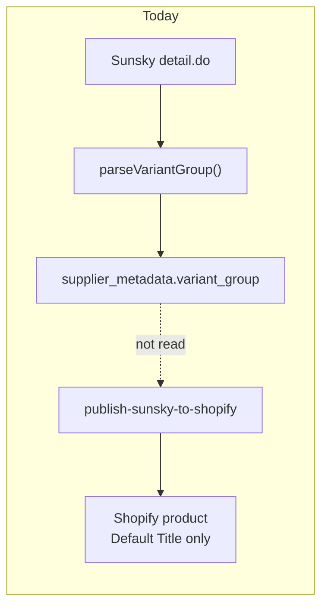

# DJI Compatibility Architecture — Sunsky `optionList` → Shopify

**Date:** 2026-06-08  
**Store:** EuroDroneParts  
**Scope:** Map Sunsky `optionList` branches to DJI drone compatibility for collections, filters, and search  
**Data:** 118 DJI B-family SKUs analyzed live (`scripts/dji-optionlist-analysis.json`); 317 `optionList` products in full DJI crawl  
**Related:** [SUNSKY_VARIANT_ARCHITECTURE.md](./SUNSKY_VARIANT_ARCHITECTURE.md), [EURODRONEPARTS_VARIANT_IMPACT.md](./EURODRONEPARTS_VARIANT_IMPACT.md)

---

## Executive Summary

Sunsky `optionList` on DJI products serves **two distinct purposes**:

| Pattern | `keywords` example | Meaning | Shopify strategy |
|---------|-------------------|---------|------------------|
| **Compatibility branch** | `Mini 4 Pro`, `For Mavic 3 Charger`, `Neo Two-Way Charging Hub` | Different purchasable SKU per drone / product line | Variant option axis **or** per-SKU metafields |
| **Kit / accessory picker** | `Transmitter`, `Charging Case`, `Lens Cover` | Sibling accessories on Sunsky (not drone fit) | Separate products or non-compatibility option axis |

**Today:** `optionList` is parsed (PR-V0) into `inventory.supplier_metadata.variant_group.option_list` but **not published** to Shopify. Compatibility for filters/search is **zero**.

**Recommendation:** Introduce a **`dji` metafield namespace** with a canonical model taxonomy, populate from title + `optionList` via an extraction pipeline at import/publish, and drive collection automation + Search & Discovery filters from those metafields.

---

## 1. Current Data

### 1.1 Sunsky API shape (official)

```json
{
  "itemNo": "TBD0421393001A",
  "groupItemNo": "TBD0421393001",
  "name": "Original 2 Pairs Propeller For DJI Mini 4 Pro / Mini 3 Pro (Black)",
  "optionList": {
    "display": "text",
    "items": [
      { "keywords": "Mini 4 Pro / Mini 3 Pro", "itemNo": "TBD0421393001A" },
      { "keywords": "Mini 2 / Mini SE",         "itemNo": "TBD0422753601A" },
      { "keywords": "Mini 3",                   "itemNo": "TBD06041602" }
    ]
  }
}
```

| Field | Stored today | Published to Shopify |
|-------|--------------|----------------------|
| `optionList.display` | `variant_group.option_list.display` | ❌ |
| `optionList.items[].keywords` | `variant_group.option_list.items[].keywords` | ❌ |
| `optionList.items[].itemNo` | `variant_group.option_list.items[].itemNo` | ❌ |
| `modelList` (color axis) | `variant_group.model_list` | ❌ |
| `fitFor` / `compatibility` | `supplier_metadata.compatibility[]` (sparse) | ❌ |
| Product title | `pages.title` / Shopify `title` | ✅ |

**Storage path:** `pages.supplier_raw` → `supplier_normalized.variant_group` → `inventory.supplier_metadata.variant_group`

### 1.2 DJI catalog `optionList` usage (measured)

| Metric | Value |
|--------|-------|
| DJI SKUs with `optionList` | **~317** (87.6% of EuroDrone categories) |
| Live sample analyzed | **118** products |
| `display: text` | Majority of compatibility lines |
| `display: picture` | Kit pickers (Osmo, RC Plus, Pocket mounts) |
| Avg branches per product | **~5–7** (propeller lines up to **11**) |

### 1.3 Keyword semantics (top patterns)

| Keyword class | Examples | Count in sample | Maps to drone model? |
|---------------|----------|-----------------|----------------------|
| **Drone / model** | `Mini 4 Pro`, `For Mavic 3 Charger`, `Flip Intelligent Flight Battery` | ~35% of products | **Yes** |
| **Kit component** | `Transmitter`, `2 TX + 1 RX + Charging Case`, `Lens Cover` | ~40% | **No** — accessory type |
| **Spec / variant** | `CN Plug`, `EU Plug`, `Black`, `White` | ~15% | Partial (region/color) |
| **Enterprise payload** | `Zenmuse X9`, `Matrice 400`, `H20` | ~10% | **Yes** (enterprise taxonomy) |

### 1.4 Target model coverage (title + branch detection, n=118)

| Canonical model | Products touching model | Notes |
|-----------------|------------------------|-------|
| **DJI Neo** | 2+ | Often grouped with Neo 2 in titles |
| **DJI Neo 2** | Present in titles (RC-N3, batteries, props) | Single-SKU lines exist; multi-model RCs list Neo 2 first |
| **DJI Flip** | 3+ | Batteries, hubs, 65W charger branches |
| **DJI Mini 4 Pro** | 6+ | Props, ND, lenses, RC Motion 3, Goggles 3 |
| **DJI Air 3** | 5+ | Shared accessories with Air 3S |
| **DJI Air 3S** | 2+ | Often paired with Air 3 in same SKU title |
| **DJI Mavic 4 Pro** | 1+ (sample); more in full catalog | 240W charger, RC 2 |
| **DJI Matrice series** | Enterprise category (26 SKUs) | Matrice 4 / 400 / 4D, payloads, propellers |
| **DJI Avata series** | 5+ Avata, 4+ Avata 2 | ND filters, Goggles 3, motion controller |

*Mini 3 / Mini 3 Pro / Mavic 3 appear frequently as `optionList` siblings on propeller and battery lines.*

### 1.5 Real product examples

**Compatibility `optionList` (propellers)**

```
TBD0421393001A — 2 Pairs Propeller (Black)
├── Mini 4 Pro / Mini 3 Pro  → TBD0421393001A
├── Mini 2 / Mini SE         → TBD0422753601A
├── Mini 3                   → TBD06041602
└── … (up to 11 branches)
```

**Compatibility `optionList` (charger family)**

```
TBD0604101601 — 65W Portable Charger (title lists Flip / Avata 2 / Neo / Mavic 3 / Air 3S)
├── Flip Intelligent Flight Battery    → TBD06056392
├── Flip Parallel Charging Hub         → TBD06055593
├── For Mavic 3 Charger                → TBD06061615
├── Mavic 3 Charging Manager           → TBD0606332701A
├── 65W Portable Charger               → TBD0604101601
└── Neo Two-Way Charging Hub           → TBD06056661
```

**Kit picker `optionList` (NOT drone compatibility)**

```
TBD06046930 — Monitor Hood For DJI RC Plus
├── Thumb Rocker
├── Strap And Waist Support Kit
├── Remote Controller
└── RC Plus Monitor Hood  ← current SKU
```

### 1.6 Current pipeline gaps



| Gap | Impact |
|-----|--------|
| No compatibility extraction | Cannot filter by drone model |
| No metafield publish | Search & Discovery filters unavailable |
| `optionList` treated as variant-only | Kit-picker keywords misclassified as drone fit |
| One `itemNo` → one Shopify product | 11 propeller branches → 11 duplicate listings |

---

## 2. Canonical Model Taxonomy

Stable IDs for metafields, collections, and search. EuroDroneParts launch set:

| `model_id` | Display name | Aliases (regex) | Collection handle |
|------------|--------------|-----------------|-------------------|
| `dji_neo` | DJI Neo | `\bneo\b` (not neo 2) | `parts-dji-neo` |
| `dji_neo_2` | DJI Neo 2 | `neo\s*2` | `parts-dji-neo-2` |
| `dji_flip` | DJI Flip | `\bflip\b` (not flip axis) | `parts-dji-flip` |
| `dji_mini_4_pro` | DJI Mini 4 Pro | `mini\s*4\s*pro` | `parts-dji-mini-4-pro` |
| `dji_air_3` | DJI Air 3 | `air\s*3\b` (not 3s) | `parts-dji-air-3` |
| `dji_air_3s` | DJI Air 3S | `air\s*3s` | `parts-dji-air-3s` |
| `dji_mavic_4_pro` | DJI Mavic 4 Pro | `mavic\s*4\s*pro` | `parts-dji-mavic-4-pro` |
| `dji_matrice` | DJI Matrice series | `matrice\s*\d`, `matrice\s*4`, `m300`, `m350`, `m30` | `parts-dji-matrice` |
| `dji_avata` | DJI Avata series | `avata\s*2?`, `\bavata\b` | `parts-dji-avata` |

**Extended IDs** (populate but optional launch collections): `dji_mini_3_pro`, `dji_mini_3`, `dji_mini_2`, `dji_mavic_3`, `dji_inspire_3`.

### Series grouping (for parent filters)

| `series_id` | Models |
|-------------|--------|
| `dji_consumer_mini` | Neo, Neo 2, Flip, Mini 4 Pro, Mini 3 Pro, Mini 3, Mini 2 |
| `dji_consumer_air` | Air 3, Air 3S |
| `dji_consumer_mavic` | Mavic 4 Pro, Mavic 3 |
| `dji_fpv` | Avata, Avata 2 |
| `dji_enterprise` | Matrice 4/400/4D, M300, M350, Zenmuse payloads |

---

## 3. Compatibility Extraction Pipeline

### 3.1 Inputs (per SKU)

1. `title` / `name`
2. `optionList.items[].keywords` + `itemNo`
3. `modelList` labels (color — not model fit)
4. `fitFor` / `compatibility` API fields if present
5. `category_name` (enterprise vs consumer)

### 3.2 Classification: compatibility vs kit-picker

```typescript
const MODEL_SIGNAL = /mini|mavic|air|avata|neo|flip|matrice|inspire|phantom|zenmuse|fpv|o3|o4/i;
const KIT_SIGNAL     = /transmitter|receiver|charging case|mount|grip|hood|damper|strap|adapter kit|lens cover|gamepad/i;

function classifyOptionKeyword(keyword: string): "model" | "kit" | "spec" {
  if (MODEL_SIGNAL.test(keyword)) return "model";
  if (KIT_SIGNAL.test(keyword)) return "kit";
  if (/plug|black|white|eu\b|us\b|cn\b/i.test(keyword)) return "spec";
  return "kit"; // default conservative — do not add to compatible_models
}
```

### 3.3 Model resolution

For each `model`-class keyword + title tokens:

1. Run alias regex table (longest match wins: `Air 3S` before `Air 3`).
2. Emit `model_id[]` (deduplicated).
3. Record provenance: `title`, `optionList`, or `both`.

**Propeller line rule:** Each `optionList` branch gets **only the models in its `keywords` string**, not all models from the parent title.

**Multi-model title rule:** `RC-N3 … Neo 2 / Mini 5 Pro / Air 3S / …` → attach **all** detected models to that SKU's metafield (fits-many-parts pattern).

### 3.4 Output: `DjiCompatibilityRecord`

```typescript
type DjiCompatibilityRecord = {
  sunsky_item_no: string;
  sunsky_option_family_root?: string;  // first itemNo in optionList graph
  compatible_model_ids: string[];      // canonical taxonomy
  compatible_series_ids: string[];
  option_list_role: "compatibility" | "kit_picker" | "mixed" | "none";
  option_branches?: Array<{
    item_no: string;
    keywords: string;
    model_ids: string[];
    keyword_class: "model" | "kit" | "spec";
  }>;
  extraction_sources: ("title" | "optionList" | "fitFor")[];
  confidence: "high" | "medium" | "low";
};
```

Persist in:

- `inventory.supplier_metadata.dji_compatibility` (JSON)
- Shopify metafields on publish (below)

---

## 4. Recommended Shopify Metafields

Namespace: **`dji`** (product-level) + **`sunsky`** (supplier traceability).

### 4.1 Product metafields (primary)

| Key | Type | Definition | Example |
|-----|------|------------|---------|
| `dji.compatible_models` | `list.single_line_text_field` | Canonical `model_id` values | `["dji_mini_4_pro","dji_mini_3_pro"]` |
| `dji.compatible_series` | `list.single_line_text_field` | Series for broad filters | `["dji_consumer_mini"]` |
| `dji.compatible_models_display` | `list.single_line_text_field` | Human labels for theme | `["DJI Mini 4 Pro","DJI Mini 3 Pro"]` |
| `dji.primary_model` | `single_line_text_field` | Main model for SEO title | `dji_mini_4_pro` |
| `dji.compatibility_source` | `single_line_text_field` | `title` \| `optionList` \| `both` | `both` |
| `dji.option_list_role` | `single_line_text_field` | `compatibility` \| `kit_picker` \| `mixed` \| `none` | `compatibility` |
| `dji.accessory_type` | `single_line_text_field` | Normalized part type | `propeller`, `battery`, `charger_hub` |
| `dji.confidence` | `single_line_text_field` | Extraction confidence | `high` |

### 4.2 Variant metafields (Phase 2 — multi-variant publish)

When `optionList` becomes Shopify variants:

| Key | Type | Definition |
|-----|------|------------|
| `dji.branch_keywords` | `single_line_text_field` | Raw Sunsky `keywords` for this variant |
| `dji.branch_model_ids` | `list.single_line_text_field` | Models for **this** branch only |
| `sunsky.item_no` | `single_line_text_field` | Sunsky purchasable SKU |
| `sunsky.option_sibling_ids` | `list.single_line_text_field` | Other `optionList.itemNo` in family |

### 4.3 Supplier / ops metafields

| Key | Type | Definition |
|-----|------|------------|
| `sunsky.group_item_no` | `single_line_text_field` | `groupItemNo` |
| `sunsky.option_list_json` | `json` | Full parsed `option_list` for debugging |
| `sunsky.import_phase` | `single_line_text_field` | `safe` \| `phase_1` \| `phase_2` |

### 4.4 Metaobject option (future)

Define **`dji_drone_model`** metaobject:

| Field | Type |
|-------|------|
| `model_id` | single line |
| `display_name` | single line |
| `series` | single line |
| `image` | file |

Then `dji.compatible_models` → `list.metaobject_reference` for richer collection cards. **Phase 1:** use plain `list.single_line_text_field` (faster to ship).

---

## 5. Mapping `optionList` → Shopify

### 5.1 Strategy matrix

| Product pattern | Shopify product model | Metafields | Variant options |
|-----------------|----------------------|------------|-----------------|
| **Single SKU, multi-model title** | 1 product, 1 variant | `compatible_models` = all models in title | `Title` only |
| **optionList = model branches** | 1 product, N variants **(PR-V2)** | Product: union of models; Variant: `branch_model_ids` | `Compatible model` or `Drone model` |
| **optionList = kit picker** | Split products **or** `Accessory type` option | `option_list_role=kit_picker` | `Kit component` (not in `compatible_models`) |
| **modelList + optionList** | 2-axis matrix **(PR-V2+)** | Both axes | `Color` + `Compatible model` |

### 5.2 Propeller family (11 branches) — target state

```
Shopify product: "DJI OEM Propellers (2 pairs)"
Option: Compatible model
Variants:
  - Mini 4 Pro / Mini 3 Pro  → SKU TBD0421393001A
  - Mini 2 / Mini SE         → SKU TBD0422753601A
  - Mini 3                   → SKU TBD06041602
  - …
Metafields:
  dji.compatible_models: [all branch models union]
  dji.accessory_type: propeller
  dji.option_list_role: compatibility
```

### 5.3 Publish pseudocode (PR-V2 extension)

```typescript
const compat = extractDjiCompatibility(normalized);

await metafieldsSet([
  { namespace: "dji", key: "compatible_models", type: "list.single_line_text_field",
    value: JSON.stringify(compat.compatible_model_ids) },
  { namespace: "dji", key: "compatible_models_display", type: "list.single_line_text_field",
    value: JSON.stringify(compat.compatible_model_ids.map(idToLabel)) },
  { namespace: "dji", key: "option_list_role", type: "single_line_text_field",
    value: compat.option_list_role },
  { namespace: "sunsky", key: "option_list_json", type: "json",
    value: JSON.stringify(normalized.variant_group.option_list) },
]);

if (compat.option_list_role === "compatibility" && optionBranches.length > 1) {
  productOptions: [{ name: "Compatible model", values: branchLabels }],
  variants: optionBranches.map(b => ({
    optionValues: [{ optionName: "Compatible model", name: b.keywords }],
    sku: b.item_no,
    metafields: [{ key: "branch_model_ids", value: JSON.stringify(b.model_ids) }],
  })),
}
```

---

## 6. Collection Automation

### 6.1 Per-model smart collections

Create **automated collections** using metafield conditions (Shopify Admin → Collections → metafield definition required first).

| Collection | Condition |
|------------|-----------|
| Parts for DJI Neo 2 | `dji.compatible_models` contains `dji_neo_2` |
| Parts for DJI Flip | `dji.compatible_models` contains `dji_flip` |
| Parts for DJI Mini 4 Pro | `dji.compatible_models` contains `dji_mini_4_pro` |
| Parts for DJI Air 3 | `dji.compatible_models` contains `dji_air_3` |
| Parts for DJI Air 3S | `dji.compatible_models` contains `dji_air_3s` |
| Parts for DJI Mavic 4 Pro | `dji.compatible_models` contains `dji_mavic_4_pro` |
| Parts for DJI Matrice | `dji.compatible_series` contains `dji_enterprise` **OR** `dji.compatible_models` contains `dji_matrice` |
| Parts for DJI Avata | `dji.compatible_models` contains `dji_avata` |

### 6.2 Accessory-type collections (orthogonal)

| Collection | Condition |
|------------|-----------|
| DJI Propellers | `dji.accessory_type` = `propeller` |
| DJI Batteries | `dji.accessory_type` = `battery` |
| DJI Charging hubs | `dji.accessory_type` = `charger_hub` |

### 6.3 Automation on publish (edge function)

```typescript
// After metafieldsSet, assign to collections by model_id
for (const modelId of compat.compatible_model_ids) {
  const handle = MODEL_COLLECTION_MAP[modelId];
  if (handle) await collectionAddProducts(handle, [productGid]);
}
```

**Tag fallback** (until metafield filters enabled):  
`dji:mini-4-pro`, `dji:air-3s`, `part:propeller` — derived from same extraction record.

### 6.4 Collection hierarchy (theme)

```
DJI Parts (parent)
├── DJI Neo 2
├── DJI Flip
├── DJI Mini 4 Pro
├── DJI Air 3 / Air 3S
├── DJI Mavic 4 Pro
├── DJI Avata & Avata 2
└── DJI Matrice & Enterprise
```

---

## 7. Filter Support

### 7.1 Shopify Search & Discovery

Enable storefront filters on:

| Filter label | Metafield | Widget type |
|--------------|-----------|-------------|
| Compatible drone | `dji.compatible_models_display` | List filter (multi-select) |
| Drone series | `dji.compatible_series` | List filter |
| Part type | `dji.accessory_type` | List filter |
| Brand | `vendor` | List filter (DJI) |

**Requirement:** Register metafield definitions with `pin: true` for filtering in Admin → Settings → Custom data → Products.

### 7.2 EuroDrone theme (Liquid)

```liquid
 Show compatibility chips on product card 

  <span class="compat-chip">{{ model }}</span>

```

PDP compatibility block (pairs with `shopify-cloner-transform` GEO pattern):

```html
<section class="ai-compatibility" data-block="compatibility">
  <h2>Passar till</h2>
  <ul>
    
      <li><a href="/collections/parts-{{ model | handleize }}">{{ model }}</a></li>
    
  </ul>
</section>
```

### 7.3 Admin filters (digitalsignal app)

Extend product list in SeoEditor / inventory views:

```sql
-- Query pages with DJI compatibility (after backfill)
SELECT platform_id, supplier_normalized->'dji_compatibility' AS compat
FROM pages
WHERE platform_id LIKE 'sunsky_%'
  AND supplier_normalized->'dji_compatibility'->'compatible_model_ids' ? 'dji_mini_4_pro';
```

---

## 8. Search Support

### 8.1 Storefront search (Shopify)

Metafields indexed when:

- `dji.compatible_models_display` has **searchable** enabled on definition
- Product title/tags include model aliases as backup

**Suggested tags for search recall:** auto-tag `Mini 4 Pro`, `Air 3S`, etc. from `compatible_models_display`.

### 8.2 AI search (`ai-search` edge function)

Extend product context payload:

```typescript
const compat = product.metafields?.dji?.compatible_models_display?.value ?? [];
const accessoryType = product.metafields?.dji?.accessory_type?.value;
// Include in embedding / keyword index
documentText += ` Compatible with: ${compat.join(", ")}. Type: ${accessoryType}.`;
```

Query routing (existing DJI detection at line ~404):

```typescript
if (lowerQuery.includes("mini 4 pro") || lowerQuery.includes("neo 2")) {
  filterModelIds.push(resolveModelId(lowerQuery));
}
```

### 8.3 SEO wizard / generate-seo

`generate-seo` already accepts `compatibility` text — wire from metafield:

```typescript
compatibility: metafields.dji.compatible_models_display.join(", ")
```

Feeds Swedish copy: *"Passar till DJI Mini 4 Pro, DJI Mini 3 Pro"*.

### 8.4 Structured data (JSON-LD)

```json
{
  "@type": "Product",
  "isAccessoryOrSparePartFor": [
    { "@type": "Product", "name": "DJI Mini 4 Pro", "brand": { "@type": "Brand", "name": "DJI" } }
  ]
}
```

Populate from `dji.compatible_models_display` for AEO/GEO visibility.

---

## 9. Implementation Roadmap

| Step | Deliverable | Effort |
|------|-------------|--------|
| **C0** | `extractDjiCompatibility()` in `_shared/dji-compatibility.ts` | 1 day |
| **C1** | Metafield definitions in Shopify (EuroDroneParts) | 0.5 day |
| **C2** | Publish metafields in `publish-sunsky-to-shopify` for **safe_today** SKUs | 0.5 day |
| **C3** | Backfill `supplier_metadata.dji_compatibility` from `supplier_raw` | 0.5 day |
| **C4** | Auto collections + tags on publish | 1 day |
| **C5** | Search & Discovery filter activation | 0.5 day |
| **C6** | PR-V2 variant axis + variant metafields for `optionList` branches | 3.5 days |

**Dependency:** C0–C5 can ship **before** PR-V2 using title-based multi-model metafields on single-variant products. PR-V2 refines per-branch accuracy for propeller/battery lines.

---

## 10. Model-Specific Notes

### DJI Neo / Neo 2

- Neo 2 has **dedicated single-SKU** batteries, props, hubs (`TBD06064161`, `TBD06064166`) — metafields: `[dji_neo_2]` only.
- RC-N3 / FPV RC 3 list **Neo 2 + Mini 5 Pro + Air 3S + …** — multi-model metafield array.

### DJI Flip

- `optionList` on charger family links Flip battery + Flip hub as **sibling products**, not variants of one charger.
- Use `accessory_type` + separate products until PR-V2 merges graph.

### DJI Mini 4 Pro

- Highest consumer cross-list density (props, ND, Goggles 3, RC Motion 3).
- Propeller `optionList` is the canonical **11-branch** compatibility pattern.

### DJI Air 3 / Air 3S

- Often co-listed in titles; extract **both** IDs when title contains `Air 3S` and `Air 3`.
- ND filters and wide-angle lenses are series-specific — branch keywords usually disambiguate.

### DJI Mavic 4 Pro

- Newer line; fewer Sunsky SKUs today.
- 240W desktop charger uses `optionList` with spec branches (Propeller / Propeller Guard / charger).

### DJI Matrice series

- Enterprise category: Matrice 4, 400, 4D, Zenmuse payloads.
- Use `dji_enterprise` series + `dji_matrice` model; optional sub-tags `matrice_400`, `matrice_4d`.
- `optionList` branches often name payloads (AS1 Speaker, AL1 Spotlight) — classify as `accessory_type`, attach to `dji_matrice`.

### DJI Avata series

- Avata 2 ND filters, Goggles 3, Motion 3 — strong cross-list with Mini 4 Pro / Air 3.
- FPV goggles products: metafield `dji.compatible_series` includes `dji_fpv` + consumer models from title.

---

## 11. Verification

```bash
# Re-analyze optionList keywords
node scripts/analyze-dji-optionlist.mjs
# Output: scripts/dji-optionlist-analysis.json

# After C0 implemented
deno test supabase/functions/_shared/dji-compatibility.test.ts
```

**Acceptance checks**

| Check | Pass criteria |
|-------|---------------|
| `TBD0421393001A` | `compatible_models` includes `dji_mini_4_pro`, `dji_mini_3_pro` |
| `TBD06064161` | Only `dji_neo_2` |
| `TBD06046930` | `option_list_role=kit_picker`; no drone models from kit keywords |
| Collection | Mini 4 Pro collection contains propeller SKU |
| Filter | Storefront filter returns batteries + props for selected model |

---

## Related Documents

- [EURODRONEPARTS_VARIANT_IMPACT.md](./EURODRONEPARTS_VARIANT_IMPACT.md) — category risk / phase gates
- [SUNSKY_VARIANT_ARCHITECTURE.md](./SUNSKY_VARIANT_ARCHITECTURE.md) — `optionList` vs `modelList`
- [SUNSKY_FIELD_MAPPING.md](./SUNSKY_FIELD_MAPPING.md) — general field map

---

## Appendix: Metafield definition JSON (Shopify Admin API)

```json
{
  "namespace": "dji",
  "key": "compatible_models",
  "name": "Compatible DJI models",
  "type": "list.single_line_text_field",
  "ownerType": "PRODUCT",
  "validations": [],
  "capabilities": {
    "adminFilterable": { "enabled": true },
    "smartCollectionCondition": { "enabled": true }
  }
}
```

Repeat for `compatible_models_display`, `compatible_series`, `accessory_type`, `option_list_role`, `primary_model`.
