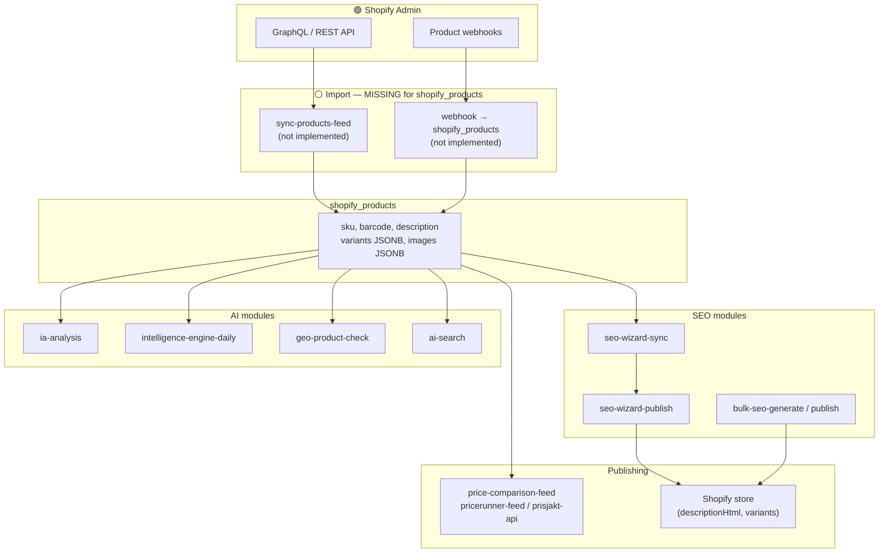
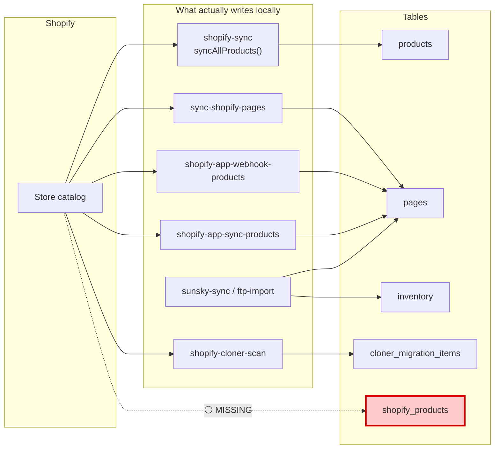
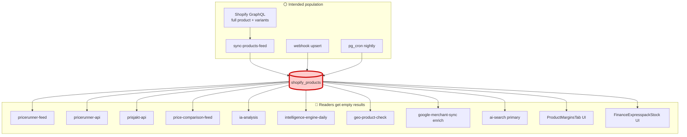
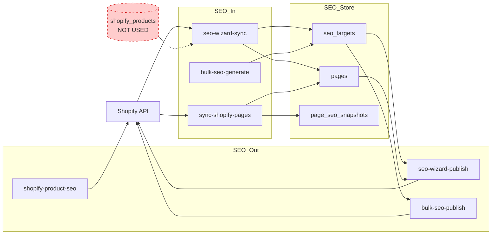
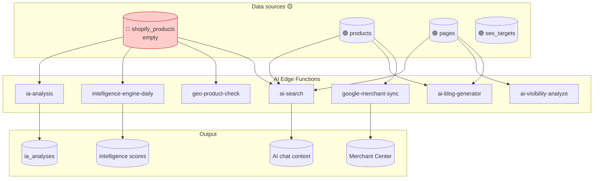
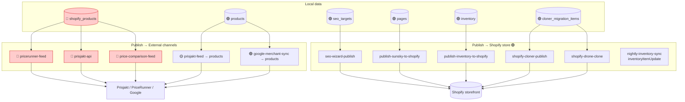

# Shopify Data Flow — Visual Architecture

**Date:** 2026-06-07  
**Scope:** How Shopify catalog data moves through import → storage → SEO → AI → publishing in DigitalSignal  
**Evidence:** Repo-wide grep + function reads (see `SHOPIFY_PRODUCTS_USAGE_REPORT.md`)

---

## Legend

| Symbol | Meaning |
|--------|---------|
| 🟢 | Working path (writer + reader exist) |
| 🔴 | **Broken** — reader exists but data never arrives, or query targets wrong schema |
| ⚪ | **Missing** — designed path with no implementation |
| 🟡 | **Duplicate** — parallel table/source for same logical data |
| ➡️ | Data flow direction |

---

## 1. Intended Pipeline (Design Intent)

What the January 2026 `shopify_products` migration and feed functions imply:



**Reality:** The import box is empty. Everything below `shopify_products` that reads this table gets **zero rows**.

---

## 2. Actual Pipeline (Verified in Code)

What really runs today — **four parallel product stores** instead of one cache:

```mermaid
flowchart TB
  subgraph SHOPIFY["🟢 Shopify"]
    GQL["Admin GraphQL"]
    REST["Admin REST"]
    WEBHOOK["products/create|update|delete"]
  end

  subgraph IMPORT["Import layer"]
    SS["🟢 shopify-sync\nsync-products / background"]
    SSP["🟢 sync-shopify-pages\n(UI sync stream)"]
    APP_WH["🟢 shopify-app-webhook-products"]
    APP_SYNC["🟢 shopify-app-sync-products"]
    CLONE_S["🟢 shopify-cloner-scan"]
    SUNSKY["🟢 sunsky-sync / ftp-import"]
  end

  subgraph DB["PostgreSQL — DUPLICATE SOURCES 🟡"]
    PRODUCTS["🟢 products\n(analytics mirror)\nWRITER: shopify-sync"]
    PAGES["🟢 pages\n(SEO registry)\nWRITERS: sync-shopify-pages,\nwebhook, app-sync"]
    SP["🔴 shopify_products\n(feed cache)\nWRITER: NONE"]
    INV["🟢 inventory\n(ops / Sunsky)\nWRITERS: sunsky, ftp"]
    SEO_T["🟢 seo_targets\nWRITER: seo-wizard-sync"]
  end

  subgraph SEO["SEO modules"]
    SWS["🟢 seo-wizard-sync\n← Shopify API live"]
    SWP["🟢 seo-wizard-publish\n→ Shopify API"]
    SSPAGES["🟢 sync-shopify-pages\n→ pages + snapshots"]
    BSG["🟢 bulk-seo-generate"]
    BSP["🟢 bulk-seo-publish\n→ seo_targets"]
  end

  subgraph AI["AI modules"]
    IA["🔴 ia-analysis\nreads shopify_products"]
    IE["🔴 intelligence-engine-daily\nreads shopify_products"]
    GEO["🔴 geo-product-check\nreads shopify_products"]
    AIS["🟡 ai-search\nshopify_products → fallback products"]
    AIV["🟢 ai-visibility-analyze\nreads pages"]
    AIB["🟢 ai-blog-generator\nreads products + pages"]
  end

  subgraph PUB["Publishing"]
    FEED_OK["🟡 prisjakt-feed\nreads products ✓"]
    FEED_BR["🔴 pricerunner-feed\nprisjakt-api\nprice-comparison-feed\nread shopify_products ✗"]
    SUN_PUB["🟢 publish-sunsky-to-shopify\npages → Shopify"]
    INV_PUB["🟢 publish-inventory-to-shopify\ninventory → Shopify"]
    CLONE_P["🟢 shopify-cloner-publish\ncloner_migration_items → Shopify"]
    GMC["🟡 google-merchant-sync\nreads products;\nenriches from shopify_products"]
  end

  GQL --> SS
  GQL --> SSP
  GQL --> SWS
  GQL --> CLONE_S
  REST --> CLONE_P
  WEBHOOK --> APP_WH

  SS --> PRODUCTS
  SSP --> PAGES
  APP_WH --> PAGES
  APP_SYNC --> PAGES
  SUNSKY --> INV
  SUNSKY --> PAGES
  CLONE_S --> CLONE_P

  SWS --> SEO_T
  SWS --> PAGES
  SWP --> SHOPIFY
  BSP --> SEO_T
  BSG --> SEO_T

  SP -.->|empty| IA
  SP -.->|empty| IE
  SP -.->|empty| GEO
  SP -.->|empty| AIS
  SP -.->|empty| FEED_BR
  PRODUCTS --> FEED_OK
  PRODUCTS --> AIS
  PRODUCTS --> AIB
  PRODUCTS --> GMC
  PAGES --> AIV
  PAGES --> SUN_PUB
  INV --> INV_PUB

  style SP fill:#ffcccc,stroke:#cc0000,stroke-width:3px
  style FEED_BR fill:#ffcccc,stroke:#cc0000
  style IA fill:#fff3cd,stroke:#cc9900
  style IE fill:#fff3cd,stroke:#cc9900
  style GEO fill:#fff3cd,stroke:#cc9900
```



---

## 3. Simplified User Journey (Requested Flow)

High-level view matching **Shopify → Import → shopify_products → SEO → AI → Publishing**:

```
┌─────────────────────────────────────────────────────────────────────────────┐
│                              SHOPIFY STORE                                   │
│         Products · Variants · Collections · Pages · Inventory               │
└──────────────────────────────────┬──────────────────────────────────────────┘
                                   │
                    ┌──────────────┴──────────────┐
                    │         IMPORT LAYER         │
                    └──────────────┬──────────────┘
           ┌───────────────────────┼───────────────────────┐
           │                       │                       │
    🟢 shopify-sync          🟢 sync-shopify-pages   🟢 webhooks / app-sync
    sync-products            (UI "Synka")             shopify-app-webhook-products
           │                       │                       │
           ▼                       ▼                       ▼
    🟡 products              🟢 pages                 🟢 pages
    (slim mirror)            (SEO registry)           (live updates)
           │
           │  ⚪ MISSING — no arrow to shopify_products
           ▼
    🔴 shopify_products  ◄─── INTENDED feed cache, NEVER POPULATED
           │
     ┌─────┴─────┬─────────────┬──────────────┐
     │           │             │              │
     ▼           ▼             ▼              ▼
  🔴 Feeds    🔴 IA/GEO    🟡 ai-search   🟡 margins UI
  (empty)     (degraded)   (fallback→      (fallback→
                            products)       order_lines)
           │
           │  SEO modules mostly bypass shopify_products
           ▼
    ┌──────────────────────────────────────────┐
    │              SEO MODULES                    │
    │  seo-wizard-sync ← Shopify API (live)     │
    │       ↓ seo_targets + pages               │
    │  seo-wizard-publish → Shopify API         │
    │  bulk-seo-generate / bulk-seo-publish     │
    │  sync-shopify-pages → page_seo_snapshots  │
    └──────────────────┬───────────────────────┘
                       │
                       ▼
    ┌──────────────────────────────────────────┐
    │               AI MODULES                  │
    │  ia-analysis · intelligence-engine-daily   │
    │  geo-product-check · ai-visibility       │
    │  ai-search · ai-blog-generator           │
    │  (most read pages/products; some read     │
    │   empty shopify_products)                │
    └──────────────────┬───────────────────────┘
                       │
                       ▼
    ┌──────────────────────────────────────────┐
    │              PUBLISHING                     │
    │  → Shopify: seo-wizard-publish, clone,   │
    │    publish-sunsky, publish-inventory      │
    │  → External feeds: pricerunner/prisjakt    │
    │    XML (broken if shopify_products empty)  │
    │  → Google Merchant: products table         │
    └──────────────────────────────────────────┘
```

---

## 4. Import Layer Detail



| Import function | File | Target table | Status |
|-----------------|------|--------------|--------|
| `sync-products` | `supabase/functions/shopify-sync/index.ts` | `products` | 🟢 Works |
| Background sync | same, `processBackgroundSync()` | `products` | 🟢 Works |
| Page stream sync | `supabase/functions/sync-shopify-pages/index.ts` | `pages` | 🟢 Works |
| Product webhook | `supabase/functions/shopify-app-webhook-products/index.ts` | `pages` | 🟢 Works |
| App product sync | `supabase/functions/shopify-app-sync-products/` | `pages` | 🟢 Works |
| **Feed cache sync** | — | `shopify_products` | ⚪ **Missing** |
| Clone scan | `shopify-cloner-scan/index.ts` | `cloner_migration_items` | 🟢 Works (not `shopify_products`) |

---

## 5. `shopify_products` in the Pipeline



---

## 6. SEO Module Flow

SEO **does not** depend on `shopify_products`. It uses **live Shopify API** + **`pages`** + **`seo_targets`**:



| Module | File | Reads | Writes | Publishes to |
|--------|------|-------|--------|--------------|
| SEO Wizard sync | `seo-wizard-sync/index.ts` | Shopify API | `seo_targets`, `pages` | — |
| SEO Wizard publish | `seo-wizard-publish/index.ts` | `seo_targets`, `pages` | — | Shopify `descriptionHtml` |
| Bulk SEO | `bulk-seo-generate`, `bulk-seo-publish` | `seo_targets` | `seo_targets` | Shopify via publish |
| Page sync | `sync-shopify-pages/index.ts` | Shopify API | `pages`, `page_seo_snapshots` | — |
| Product SEO tool | `shopify-product-seo/index.ts` | Shopify REST | — | Shopify REST |

---

## 7. AI Module Flow



| AI function | Primary read | `shopify_products`? | Fallback |
|-------------|--------------|---------------------|----------|
| `ia-analysis` | `shopify_products` | 🔴 Yes (empty) | `products` |
| `intelligence-engine-daily` | `shopify_products` | 🔴 Yes | `safe()` → null metrics |
| `geo-product-check` | `shopify_products` | 🔴 Yes | none |
| `ai-search` | `shopify_products` | 🟡 Primary | `products`, `pages` |
| `ai-visibility-analyze` | `pages` | 🟢 No | — |
| `ai-blog-generator` | `products`, `pages` | 🟢 No | — |
| `google-merchant-sync` | `products` | 🟡 Enrichment only | `meta_description` |

---

## 8. Publishing Layer

Publishing splits into **back to Shopify** vs **external feeds**:



---

## 9. Highlight Summary

### ⚪ Missing population paths

| Path | Expected writer | Status |
|------|-----------------|--------|
| Shopify → `shopify_products` | `shopify-sync` `sync-products-feed` | **Not in codebase** |
| Webhook → `shopify_products` | `shopify-app-webhook-products` | Writes **`pages` only** |
| Cron → `shopify_products` | `sync_shopify_products` | **UI placeholder only** (`SystemHealthAdmin.tsx`) |
| `products` → mirror → `shopify_products` | DB trigger / post-sync hook | **None** |
| Clone → local cache | `shopify-cloner-publish` | Publishes to **target Shopify only** |

### 🔴 Broken sync paths

| Path | Problem | File evidence |
|------|---------|---------------|
| `shopify-sync` → `shopify_products` | Writes **`products`** instead | `shopify-sync/index.ts` ~1347 |
| `pricerunner-feed` / `prisjakt-api` / `price-comparison-feed` | Read **empty** `shopify_products` | Feed functions |
| `ia-analysis` / `geo-product-check` / `intelligence-engine-daily` | Metrics from **empty** cache | AI functions |
| `sync_shopify_products` job | **Does not exist** | Hardcoded demo log only |
| RLS (historical) | Original policies used `tenant_id = auth.uid()` | Fixed May 2026 — still no writer |

### 🟡 Duplicate data sources

| Logical data | Parallel tables | Who writes | Who reads |
|--------------|-----------------|------------|-----------|
| **Product catalog summary** | `products` vs `shopify_products` | `shopify-sync` → `products` only | Feeds split across both |
| **Product SEO / content** | `pages` vs `seo_targets` vs `shopify_products.description` | `sync-shopify-pages`, webhooks, SEO wizard | SEO + AI modules |
| **SKU / price for feeds** | `shopify_products` vs `products` vs `inventory` vs `order_line_items` | Various | Margins, feeds, expresspack |
| **Prisjakt feed** | `prisjakt-feed` uses `products`; `prisjakt-api` uses `shopify_products` | — | **Inconsistent** |
| **Collections count** | `product_type_collections.shopify_products_count` vs actual table | Manual UI integer | `CuratedCollections.tsx` |

---

## 10. Fix — Closing the Gap

To make the intended diagram real:

```
Shopify API
    ↓  [ADD] sync-products-feed + webhook upsert
shopify_products  ← populate
    ↓
Feeds (pricerunner, prisjakt-api, price-comparison)  ← unbroken
    ↓
AI modules (ia-analysis, geo, intelligence-daily)  ← real metrics
    ↓
SEO modules (optional: read rich description/SKU from cache)
    ↓
Publishing (feeds to external; seo-wizard to Shopify)
```

**Minimum change:** Extend `supabase/functions/shopify-sync/index.ts` with a dual upsert to `shopify_products` using a rich GraphQL product query (variants, images, `descriptionHtml`).

---

## 11. File Index (Quick Reference)

| Layer | Key files |
|-------|-----------|
| **Import** | `shopify-sync/index.ts`, `sync-shopify-pages/index.ts`, `shopify-app-webhook-products/index.ts` |
| **Cache** | Migration `20260111175813_*.sql` |
| **SEO** | `seo-wizard-sync/index.ts`, `seo-wizard-publish/index.ts`, `bulk-seo-publish/index.ts` |
| **AI** | `ia-analysis/index.ts`, `intelligence-engine-daily/index.ts`, `ai-search/index.ts`, `geo-product-check/index.ts` |
| **Publish → Shopify** | `publish-sunsky-to-shopify/index.ts`, `publish-inventory-to-shopify/index.ts`, `shopify-cloner-publish/index.ts` |
| **Publish → Feeds** | `pricerunner-feed/index.ts`, `prisjakt-api/index.ts`, `price-comparison-feed/index.ts`, `prisjakt-feed/index.ts` |
| **Shared feed helper** | `_shared/shopify-product-feed.ts` |

---

## Related

- `SHOPIFY_PRODUCTS_USAGE_REPORT.md` — reader/writer inventory
- `ECOMMERCE_SCHEMA_FIX.md` — JSONB / ghost-table fixes
- `INVENTORY_COMPLIANCE_FIX.md` — clone publish HS code hook
